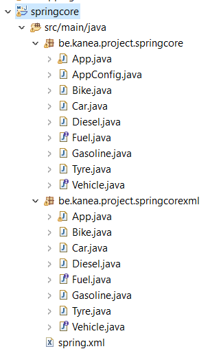
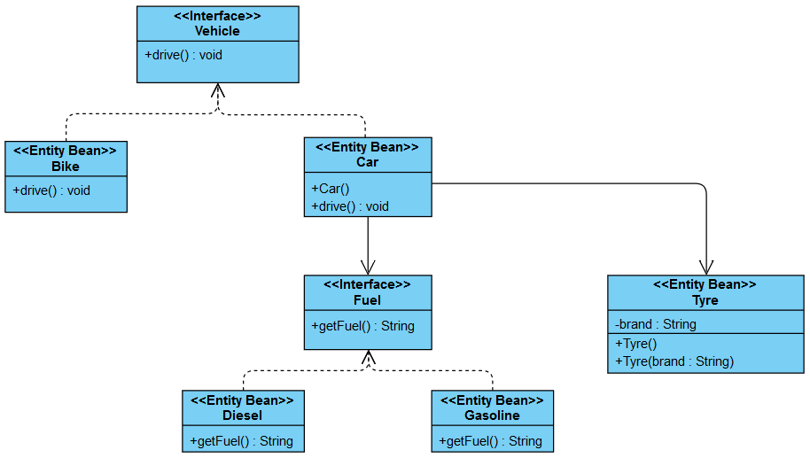

# Spring Core
 
 
<h4>Purpose </h4>
 

 This project is a part of my online documentation to keep solutions hand on. Anyone who need it can use it as he wish.

<h4>Description : On the way to mastering  Spring</h4>

Through a ApplicationContext as container, I start with the basics. For the configuration part, I use xml files and annotations with class configuration in separate packages. 
 
 Find here the annotations used : @Component, @Primary, @Autowired, @Qualifier, @Configuration and @ComponentScan

<h4>Project</h4>

<h4>Class Diagram</h4>

